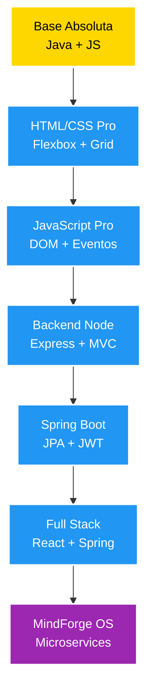

<div align="center">

# 👨‍💻 Ana Luiza

### Desenvolvedor em Formação | Seguindo o Plano "A Desenvolvedora"

[](https://www.linkedin.com/in/analuizafullstack/)
[](mailto:a.luiza.fullstack@gmail.com)

</div>

---

## 🚀 Sobre Mim

> *"Cada projeto é pensado como produto real, com arquitetura limpa e diferencial técnico"*

Estou em uma jornada estruturada de desenvolvimento full stack, seguindo um plano de estudos robusto que me levará desde os fundamentos até aplicações complexas com arquitetura profissional.

Meu diferencial: não apenas codifico — **projeto cada linha pensando em impacto real**.

```java
public class MinhaJornada {
    private String fase = "FASE 1 - Base Absoluta";
    private String foco = "Java POO + JavaScript Fundamentos";
    private boolean determinacao = true;
    
    public void executar() {
        while (determinacao) {
            estudar();
            praticar();
            construir();
            evoluir();
        }
    }
}
```

---

## 🗺️ Roadmap de Aprendizado



**🟡 = Estudando Agora (FASE 1)** | **🔵 = Próximas Fases (2-6)** | **🟣 = Projeto Final**

---

## 📚 O Que Estou Estudando Agora

**📖 Cursos Ativos:**
- Java COMPLETO – POO + Projetos
- JavaScript e TypeScript do básico ao avançado

**💡 Conceitos em Foco:**
```
✅ Variáveis e Tipos de Dados    ✅ Estruturas Condicionais    ✅ Loops (for, while)
✅ Arrays e Listas               🔄 Classes e Objetos          🔄 Encapsulamento
⏳ Herança                       ⏳ Polimorfismo               ⏳ Collections Framework
```

---

## 📖 Próximos Estudos

**FASE 2 - HTML/CSS:**
- Modern HTML & CSS From the Beginning
- CSS – The Complete Guide (Flexbox, Grid, Sass)

**FASE 3 - JavaScript Avançado:**
- JavaScript – The Complete Guide

**FASE 4 - Backend Node:**
- The Web Developer Bootcamp – Colt Steele

**FASE 5 - Spring Boot:**
- Spring Boot Expert (JPA, REST, JWT, OAuth2, Docker, AWS)

**FASE 6 - Full Stack:**
- Spring Boot + ReactJS: Fullstack do Zero ao Deploy
- Full-Stack Java Development with Spring Boot & React

---

## 🎯 Projetos & Exercícios

> 📌 **Esta seção será atualizada conforme eu desenvolvo!**

### 🌱 Mini Projetos

<table>
<tr>
<td width="50%">

### 📝 Exercícios POO
Praticando fundamentos de Java

**Conceitos aplicados:**
- ✅ Classes e Objetos
- ✅ Atributos e Métodos
- 🔄 Encapsulamento (getters/setters)
- ⏳ Construtores
- ⏳ Herança

**Status:** Em andamento

</td>
<td width="50%">

### 💻 Desafios JavaScript
Exercícios práticos de lógica

**Conceitos aplicados:**
- ✅ Variáveis e funções
- 🔄 Manipulação de arrays
- ⏳ Objetos e métodos
- ⏳ DOM básico
- ⏳ LocalStorage

**Status:** Em andamento

</td>
</tr>
</table>

### 🚀 Projetos Principais

<table>
<tr>
<td width="50%">

### 🎮 habit-intelligence-console
Sistema de hábitos com pontuação e ranking

**Stack:** Java, POO, Collections

**Diferenciais:**
- Sistema de pontuação inteligente
- Ranking de desempenho
- Estatísticas semanais
- Arquitetura em camadas

**Status:** ⏳ Não iniciado

</td>
<td width="50%">

### 🌐 digital-presence
Landing page profissional

**Stack:** HTML5, CSS3, Flexbox, Grid

**Diferenciais:**
- Mobile First
- Dark/Light Mode
- Animações suaves
- Design responsivo

**Status:** ⏳ Não iniciado

</td>
</tr>

<tr>
<td width="50%">

### 💼 behavioral-task-system
Gerenciador de tarefas inteligente

**Stack:** JavaScript, DOM, Chart.js

**Diferenciais:**
- Categorias automáticas
- Drag & Drop
- Estatísticas visuais
- LocalStorage

**Status:** ⏳ Não iniciado

</td>
<td width="50%">

### 🌍 adaptive-blog
Blog com arquitetura MVC

**Stack:** Node.js, Express, MVC

**Diferenciais:**
- Autenticação completa
- Sistema de comentários
- Likes e reações
- Tema adaptativo

**Status:** ⏳ Não iniciado

</td>
</tr>

<tr>
<td width="50%">

### 🔐 cognitive-api
API REST segura

**Stack:** Spring Boot, JWT, Docker

**Diferenciais:**
- JWT + OAuth2
- Swagger docs
- Rate limiting
- Docker Compose

**Status:** ⏳ Não iniciado

</td>
<td width="50%">

### 💎 conscious-dashboard
Dashboard full stack realtime

**Stack:** React, TypeScript, Spring Boot

**Diferenciais:**
- WebSocket
- Notificações realtime
- UI profissional
- Microanimações

**Status:** ⏳ Não iniciado

</td>
</tr>
</table>

**Legenda:**
- ✅ Já estudei e pratiquei
- 🔄 Estudando atualmente
- ⏳ Próximos passos / Não iniciado

---

## 👑 PROJETO FINAL: MindForge OS

> **O objetivo final de toda a jornada**

**Plataforma completa de produtividade com IA e arquitetura distribuída**

### 🏗️ Arquitetura Planejada
```
mindforge/
  ├── backend/
  │   ├── auth-service/
  │   ├── user-service/
  │   └── productivity-service/
  ├── frontend/
  └── docker-compose.yml
```

### 🛠️ Stack Tecnológica
- **Backend:** Spring Boot (Microservices)
- **Frontend:** React + TypeScript
- **Database:** PostgreSQL + Redis
- **Mensageria:** RabbitMQ
- **Infraestrutura:** Docker, CI/CD

### ⭐ Features Planejadas
- 🧠 Sistema inteligente de hábitos
- 🤖 IA simulada de recomendação
- 🎯 Sistema de foco profundo
- 📊 Dashboards comportamentais
- 📝 Logs profissionais
- 📈 Monitoramento básico

**Status:** 🎯 Meta final da jornada

---

### 🛠️ Tecnologias que Estou Aprendendo

<div align="center">

### Foco Atual - FASE 1


### FASE 2 - Próxima


### FASE 3-4 - Backend Fundamentos


### FASE 5-6 - Full Stack Pro


</div>

**O que já aprendi:**
```
✓ Lógica de Programação      ✓ Variáveis e Tipos          ✓ Estruturas Condicionais
✓ Loops (for, while)          ✓ Arrays                     🔄 Classes e Objetos
🔄 Encapsulamento            ⏳ Herança                   ⏳ Polimorfismo
```

---

## 📊 Minha Jornada no GitHub

<div align="center">
  
  
</div>

<div align="center">
  
</div>

---

## 🎯 Objetivos 2025-2026

### Até Final de 2025
- [ ] Concluir cursos ativos (Java COMPLETO + JavaScript/TypeScript)
- [ ] Finalizar FASE 1 - Base Absoluta
- [ ] Desenvolver `habit-intelligence-console`
- [ ] Documentar projeto com README profissional

### Primeiro Semestre 2026
- [ ] Completar FASE 2 (HTML/CSS) e FASE 3 (JavaScript Pro)
- [ ] Desenvolver `digital-presence` e `behavioral-task-system`
- [ ] Iniciar estudos de backend com Node.js
- [ ] Contribuir para projetos open source

### Segundo Semestre 2026
- [ ] Chegar na FASE 5 (Spring Boot)
- [ ] Ter 6 projetos completos no GitHub
- [ ] Começar planejamento do MindForge OS
- [ ] Publicar artigos sobre minha jornada

---


## 💭 Filosofia de Desenvolvimento

<table>
<tr>
<td align="center" width="25%">

### 🎯 Arquitetura
Planejar antes de executar

</td>
<td align="center" width="25%">

### 💡 Propósito
Resolver problemas reais

</td>
<td align="center" width="25%">

### 📈 Evolução
Melhorar continuamente

</td>
<td align="center" width="25%">

### 🏗️ Qualidade
Código limpo é padrão

</td>
</tr>
</table>

> "Código sem propósito é só texto. Eu construo sistemas que fazem diferença."

---

## 📖 Recursos de Estudo

### Cursos Principais
- ☕ Java COMPLETO – POO + Projetos
- 🟨 JavaScript e TypeScript do básico ao avançado
- 🎨 Modern HTML & CSS From the Beginning *(próximo)*
- 🍃 Spring Boot Expert *(futuro)*
- ⚛️ Spring Boot + React: Full Stack *(futuro)*

### Complementares
- 📚 Documentação oficial (Java, JS, MDN)
- 🎥 Canais técnicos do YouTube
- 📖 Clean Code, Design Patterns
- 💬 Comunidades: Stack Overflow, Reddit, Discord

---

## 🌟 Por Que Este Caminho?

Escolhi seguir um plano estruturado porque acredito que:

- 📐 **Fundamentos sólidos** são inegociáveis
- 🏗️ **Arquitetura** vem antes do código
- 🎯 Cada projeto deve ter **propósito real**
- 📈 **Evolução gradual** é sustentável
- 💼 Pensar como **produto** desde o início

Não é sobre a tecnologia da moda, é sobre construir a base certa para resolver problemas complexos no futuro.

---

## 💬 Vamos Conectar?

Estou sempre aberto para:
- 🤝 Trocar experiências com outros estudantes
- 💡 Discutir arquitetura e boas práticas
- 📚 Compartilhar recursos de estudo
- 🚀 Colaborar em projetos

<div align="center">

[](https://www.linkedin.com/in/analuizafullstack/)
[](mailto:a.luiza.fullstack@gmail.com)

</div>

---

<div align="center">

### ⭐ *"Transformo ideias em sistemas inteligentes, escaláveis e seguros"*


**Acompanhe minha jornada! 🚀**

</div>
